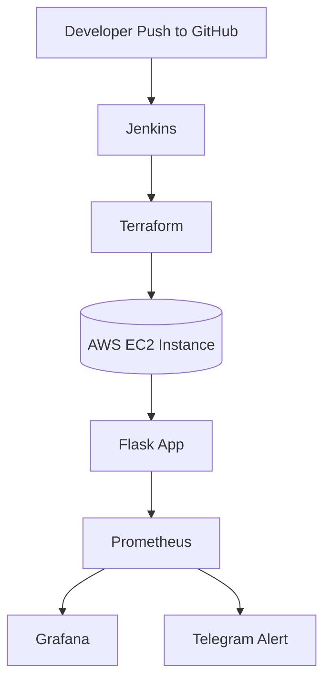

# 🚀 Infra Deployment & Monitoring

Automated the deployment of a Flask-based monitoring application on AWS EC2 using Jenkins, Terraform, Docker, Prometheus, and Grafana — with real-time metrics visualization and Telegram alerting.

---

## 📚 Table of Contents

- [About the Project](#about-the-project)
- [Tech Stack](#tech-stack)
- [Architecture](#architecture)
- [CI/CD Workflow](#cicd-workflow)
- [Monitoring & Alerting](#monitoring--alerting)
- [Setup Instructions](#setup-instructions)
- [License](#license)

---

## 📌 About the Project

This project automates the deployment of a real-time Flask app with infrastructure provisioning and monitoring:
- Uses **Jenkins + Terraform** for CI/CD and infrastructure as code
- **Prometheus** collects application metrics
- **Grafana** visualizes these metrics
- **Telegram alerts** notify in case of issues

---

## 🧰 Tech Stack

| Category         | Tools / Services                              |
|------------------|------------------------------------------------|
| Infrastructure   | AWS EC2, Terraform                            |
| CI/CD            | Jenkins, GitHub                               |
| Containerization | Docker                                        |
| Monitoring       | Prometheus, Grafana                           |
| Scripting        | Bash, Python                                  |
| Alerts           | Telegram Bot API                              |

---

## 🏗️ Architecture



---

## 🔁 CI/CD Workflow

1. **Jenkins** is triggered when a developer pushes code to the GitHub repository.
2. Jenkins executes a pipeline defined in the `Jenkinsfile`:
   - Checks out the code
   - Retrieves AWS credentials and SSH key from Jenkins Credentials
   - Runs `terraform init` and `terraform apply` to provision the EC2 instance and security group
3. Jenkins uses **SSH** to connect to the newly provisioned EC2 instance
   - Installs required packages (`python3`, `pip`, `docker`)
   - Deploys the Flask app
4. **Docker** runs containers for:
   - Prometheus (with custom `prometheus.yml`)
   - Grafana
5. **Flask app** starts and exposes metrics at `/metrics` endpoint
   - Prometheus scrapes these metrics every few seconds
   - Grafana queries Prometheus and displays the data visually

📌 **Automated**, **repeatable**, and **monitorable** deployment pipeline!

---

## 📊 Monitoring & Alerting

### 🔍 Prometheus
- Scrapes `/metrics` endpoint from Flask
- Configuration in `prometheus.yml`:

```yaml
scrape_configs:
  - job_name: 'flask_app'
    static_configs:
      - targets: ['localhost:5001']
```

### 📊 Grafana
- Access at `http://<your-ec2-ip>:3000` (default: `admin/admin`)
- Add Prometheus as a data source: `http://localhost:9090`
- Create dashboards to visualize `request_count` and other metrics

### 🚨 Telegram Alerts
1. Create a bot via [@BotFather](https://t.me/botfather)
2. Get your token & chat ID
3. Add a Telegram notification channel in Grafana:
   - Go to *Alerting → Notification Channels → Telegram*
   - Paste bot token & chat ID
4. Add alerts to your panels
   - Example: `request_count > 10`
   - Message: “🚨 High request rate detected!”

---

## ⚙️ Setup Instructions

### ✅ Prerequisites
- AWS account with EC2 access
- SSH key pair uploaded to Jenkins
- Jenkins installed with `Git`, `Terraform`, and `SSH Agent` plugins
- Docker installed on EC2
- Telegram bot and chat ID

### 📂 Steps

1. **Clone the repo**

```bash
git clone https://github.com/Farhan2330/flask-monitoring.git
cd flask-monitoring
```

2. **Configure Jenkins credentials**
   - `aws-access-key-id` and `aws-secret-access-key`
   - `aws-ssh-key` (your EC2 private key)

3. **Run Terraform**

```bash
terraform init
terraform apply -auto-approve
```

4. **Provision EC2**
   - Jenkins will SSH into the EC2 instance and run:

```bash
sudo apt update
sudo apt install python3-pip docker.io -y
pip3 install flask prometheus_client
```

5. **Deploy Flask + Monitoring Stack**

```bash
# Run Prometheus
docker run -d -p 9090:9090 --name prometheus \
  -v ~/prometheus.yml:/etc/prometheus/prometheus.yml \
  prom/prometheus

# Run Grafana
docker run -d -p 3000:3000 --name grafana grafana/grafana
```

6. **Access services**
- Flask App: `http://<your-ec2-ip>:5001`
- Prometheus: `http://<your-ec2-ip>:9090`
- Grafana: `http://<your-ec2-ip>:3000`

---


## 📄 License

This project is licensed under the [MIT License](LICENSE).

---

Made with 💻 and ☕ by **Mohammed Farhan Ahmed**
